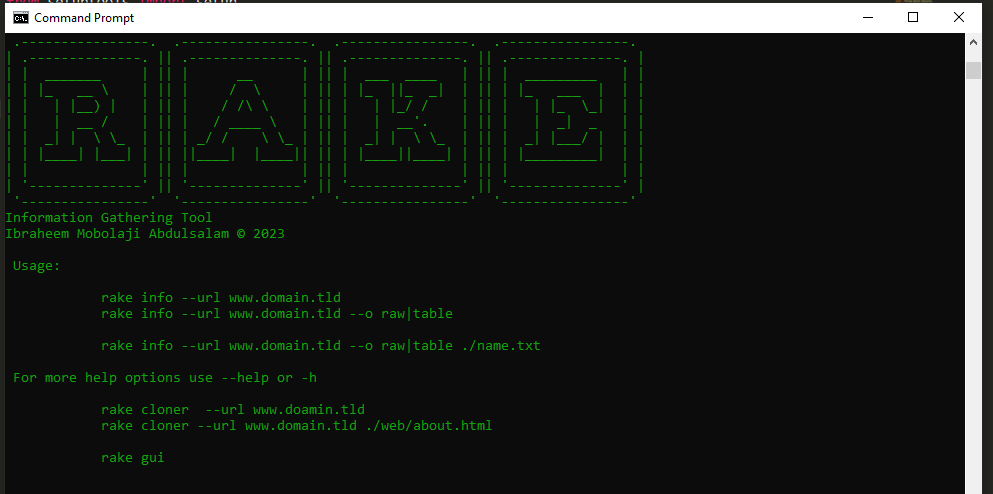

# Rake
## _Whois on command line_
Rake is a domain level information gathering tool



## Installation
### Windows
```sh
git clone --depth 1 https://www.github.com/moriire/rake
cd rake
sudo install.sh
```
### Linux
```sh
git clone --depth 1 https://www.github.com/moriire/rake
cd rake
python setup.py install
```
## Usage
```sh
rake start --url domain-name -o raw|table|json --save txt|json|csv myfilename.ext
```